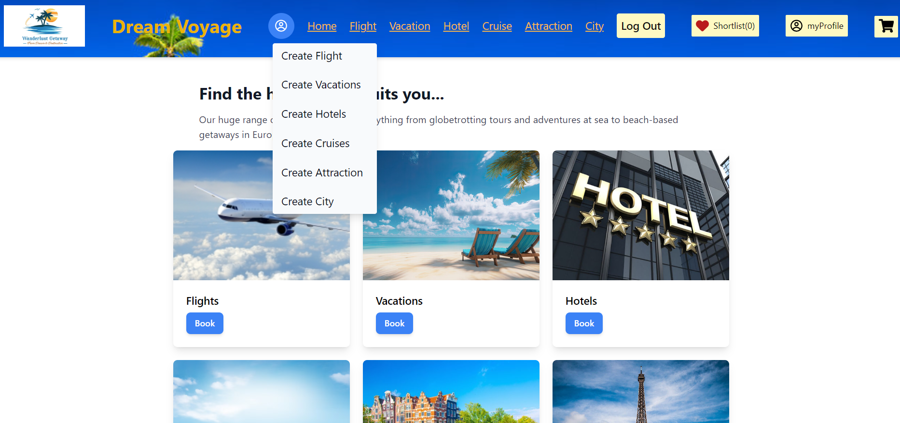
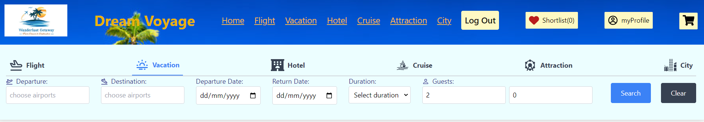
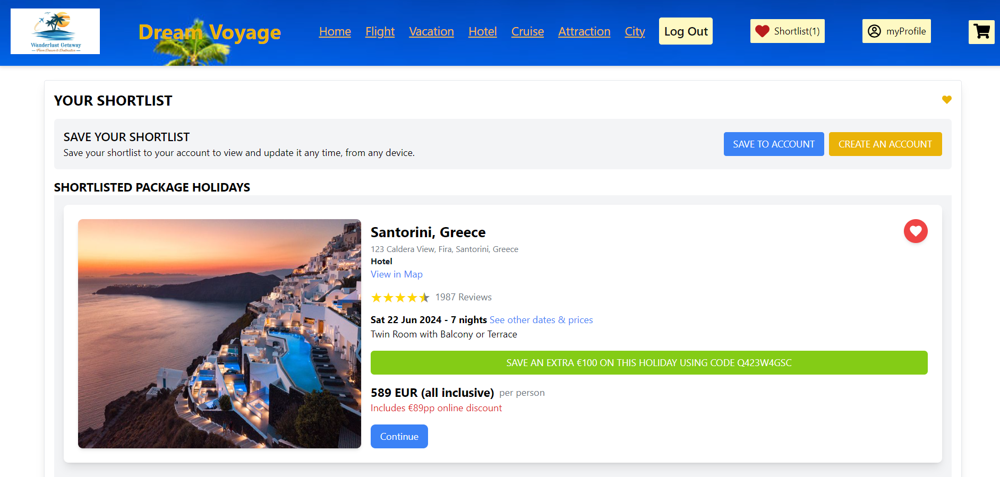

# React + Vite

This template provides a minimal setup to get React working in Vite with HMR and some ESLint rules.

Currently, two official plugins are available:

- [@vitejs/plugin-react](https://github.com/vitejs/vite-plugin-react/blob/main/packages/plugin-react/README.md) uses [Babel](https://babeljs.io/) for Fast Refresh
- [@vitejs/plugin-react-swc](https://github.com/vitejs/vite-plugin-react-swc) uses [SWC](https://swc.rs/) for Fast Refresh

-----------------------------------------------------------------------------------------------------

Dream Voyage Agency Project-3

Technologies Used:

Frontend:
React, Redux-toolkit, Javascript

Backend:
Node.js, Express.js, MongoDB

Link to Live Site:
https://

----------------------------------------------------------------------------------------------------

Table of Contents

1. Introduction
2. Features
3. Installation
4. Configuration
5. Project Structure
6. API Documentation
7. Contributing

Introduction
Welcome to Dream Voyage agency! This README provides an overview of the Dream Voyage agency project, including installation instructions, usage guidelines, and development information. This document is designed to help you get started with the project quickly and efficiently.

Features
- Travel Packages: Browse and book travel packages to various - destinations.
- User Profiles: Create and manage user profiles with booking purchases.
- Payment Integration: Payment gateway integration using Stripe documentation for seamless transactions.
- Reviews, Sort and Ratings: User reviews, sort and ratings for travel packages.
- Admin Dashboard: Comprehensive dashboard for managing packages, users, and bookings.

Installation
Prerequisites
- Node.js (v14.x or higher)
- npm (v6.x or higher)
- @reduxjs/toolkit
- react-router-dom (v6.x or higher)
- MongoDB (v4.x or higher)

Steps
1. Clone the Repository:
https://github.com/Ladomirjak1989/Project-3-backEnd
https://github.com/Ladomirjak1989/Project-3-frontEnd
cd backEnd
cd frontEnd

2. Install Dependencies:
npm install

3. Set Up Environment Variables:
Create a .env file in the root directory and add the following variables:

TOKEN_SECRET=«generate_strong_secret_here»
MONGO_DB="link to MongoDB"
ORIGIN="http://localhost:"
STRIPE_PUBLISHABLE_KEY="pk_test"
STRIPE_SECRET_KEY="sk_test"

4. Run the Application:
npm run dev

Accessing the Application
Frontend: Open your browser and navigate to http://localhost:5173
API Documentation: Access the API documentation at http://'http://localhost:4010'

------------------------------------------------------------------------------------------------------

- API URL Configuration
To set up the API URL, update the API_URL variable in your frontend configuration file:
export const API_URL = 'http://localhost:4010';

-------------------------------------------------------------------------------------------------------

- Stripe Configuration
To set up Stripe for payment processing, add your Stripe secret key to the .env file:
STRIPE_PUBLISHABLE_KEY="pk_test"
STRIPE_SECRET_KEY="sk_test"

------------------------------------------------------------------------------------------------------

BackEnd Project Structure
Here is an overview of the backEnd project structure:

backEnd/
│
├── config/
│   └── index.js
│
├── db/
│   ├── city.json
│   ├── cruise.json
│   ├── flight.json
│   ├── hotel.json
│   ├── index.js
│   └── vacations.json
│
├── error-handling/
│   └── errorHandler.js
│
├── middleware/
│   ├── jwt.middleware.js
│   └── roles.middleware.js
│
├── models/
│   ├── City.model.js
│   ├── Cruise.model.js
│   ├── Flight.model.js
│   ├── Hotel.model.js
│   ├── Purchase.model.js
│   ├── User.model.js
│   └── Vacation.model.js
│
├── routes/
│   ├── admin.routes.js
│   ├── auth.routes.js
│   ├── city.routes.js
│   ├── cruise.routes.js
│   ├── flight.routes.js
│   ├── hotel.routes.js
│   ├── index.routes.js
│   ├── user.routes.js
│   └── vacation.routes.js
│
├── .env
├── .gitignore
├── app.js
├── package-lock.json
├── package.json
└── server.js

Description of Key Directories and Files
. config/: Contains configuration files for the application.
. db/: JSON files used for seeding the database.
. error-handling/: Middleware for error handling.
. middleware/: Custom middleware for authentication and authorization.
. models/: Mongoose models representing the data schema.
. routes/: Express routes for different parts of the application.
. app.js: Main application file to start the server.
. server.js: Entry point for the server.
. .env: Environment variables configuration file.
. .gitignore: Specifies files to be ignored by Git.

-----------------------------------------------------------------------------------------------------

FrontEnd Project Structure
Here is an overview of the frontEnd project structure:

frontEnd/
│
├── context/
│
├── dist/
│
├── node_modules/
│
├── public/
│
├── src/
│   ├── assets/
│   ├── components/
│   │   ├── BookingForm/
│   │   ├── Button/
│   │   ├── ContactBanner/
│   │   ├── CruiseDeal/
│   │   ├── CruiseEl/
│   │   ├── FlightEl/
│   │   ├── FlightOfferForms/
│   │   ├── Footer/
│   │   ├── Header/
│   │   ├── HotelEl/
│   │   ├── Loader/
│   │   ├── MapWithDestinations/
│   │   ├── NavBar/
│   │   ├── PaymentForm/
│   │   ├── PopUp/
│   │   ├── PopUpMessage/
│   │   ├── PromoBanner/
│   │   ├── RatingStars/
│   │   ├── Searchbar/
│   │   ├── SortList/
│   │   ├── Swiper/
│   │   ├── VacationDeals/
│   │   ├── VacationEl/
│   │   ├── VacationOfferForm/
│   │
│   ├── Pages/
│   │   ├── AboutPage/
│   │   ├── AttractionPage/
│   │   ├── BookingPage/
│   │   ├── CartPage/
│   │   ├── CityDetailsPage/
│   │   ├── CityPage/
│   │   ├── CompletionPage/
│   │   ├── ContactPage/
│   │   ├── CreateFlightPage/
│   │   ├── CreateVacationPage/
│   │   ├── CruisesDetailsPage/
│   │   ├── CruisesPage/
│   │   ├── DashboardPage/
│   │   ├── FlightDetails/
│   │   ├── HomePage/
│   │   ├── HotelDetailsPage/
│   │   ├── HotelsPage/
│   │   ├── LoginPage/
│   │   ├── NotFoundPage/
│   │   ├── PaymentPage/
│   │   ├── Profile/
│   │   ├── ShortListPage/
│   │   ├── SignUp/
│   │   ├── TermsAndConditionsPage/
│   │   ├── UpdatedFlightPage/
│   │   ├── UpdateVacation/
│   │   ├── VacationDetails/
│   │   ├── VacationPage/
│   │
│   ├── routers/
│   │   ├── AdminRouter.jsx
│   │   ├── PrivateRouter.jsx
│   │   └── routers.jsx
│   │
│   ├── services/
│   │
│   ├── store/
│   │   ├── slices/
│   │       ├── cartSliceReducer.js
│   │       ├── citySearchSlice.js
│   │       ├── citySliceReducer.js
│   │       ├── cruiseDealSliceReducer.js
│   │       ├── cruiseSearchSlice.js
│   │       ├── cruiseSliceReducer.js
│   │       ├── fetchCitySliceAsync.js
│   │       ├── fetchCruiseSliceAsync.js
│   │       ├── fetchFlightSliceAsync.js
│   │       ├── fetchHotelSliceAsync.js
│   │       ├── fetchSearchSliceAsync.js
│   │       ├── fetchSessionSliceAsync.js
│   │       ├── fetchVacationSliceAsync.js
│   │       ├── flightSearchSlice.js
│   │       ├── flightSliceReducer.js
│   │       ├── hotelSearchSlice.js
│   │       ├── hotelSliceReducer.js
│   │       ├── popUpSliceReducer.js
│   │       ├── profileSliceReducer.js
│   │       ├── ratingSliceReducer.js
│   │       ├── sessionSliceReducer.js
│   │       ├── shortListSliceReducer.js
│   │       ├── sortSliceReducer.js
│   │       ├── vacationDealsSliceReducer.js
│   │       ├── vacationSearchSlice.js
│   │       ├── vacationSliceReducer.js
│   │   └── index.js
│   │
│   ├── utils/
│   │   └── variables.js
│   │
│   ├── App.css
│   ├── App.jsx
│   ├── index.css
│   ├── index.jsx
│   └── main.jsx
│
├── .eslint.rc.js
├── .gitignore
├── index.html
├── package-lock.json
├── package.json
├── postcss.config.js
├── README.md
├── tailwind.config.js
└── vite.config.js

Description of Key Directories and Files:
- src/: Contains the source code for the frontend.
- components/: Reusable UI components.
- pages/: Different pages of the application.
- routers/: Router configuration for different routes.
- store/: Redux store configuration.
- utils/: Utility functions and variables.
- .gitignore: Specifies files to be ignored by Git.
- README.md: Project documentation.
- tailwind.config.js: Tailwind CSS configuration file.
- vite.config.js: Vite configuration file for the frontend.

-----------------------------------------------------------------------------------------------------

Contributing
To contribute, follow these steps:
1. Fork the repository.
2. Create a new branch for your feature or bugfix.
3. Make your changes and commit them with a descriptive message.
4. Push your changes to your fork.
5. Submit a pull request to the main branch.

-------------------------------------------------------------------------------------------------------

Log in/Sign up:

A user can log in with their login credentials. If a user doesn't have an account, they can create a new one by clicking on the sign up button, or they can log in as a demo user in the log in form.

-------------------------------------------------------------------------------------------------------

Home Page:
image:
This is the Home page where a logged in/out user can navigate to flightPage, vacationPage, hotelPage, CruisePage, CityPage. Only a logged in user can access the 'Book' link.

-------------------------------------------------------------------------------------------------------

Vacation page:
image:
Presented are the list of vacations on Dream Voyage.

--------------------------------------------------------------------------------------------------------

Vacation details page:
image:
When a user clicks on a button "continue", they are redirected to the vacation detail page. This page has the all information about the vacation such as name, destination, description, duration, price, accommodation, activities, reviews. If the users has own profiles, they can book chosen by them vacations.

-------------------------------------------------------------------------------------------------------

Admin functions:

 image:
Admin can Create, Read, Update, Delete (CRUD) Operations: Admins can add new flight and vacation packages, update existing ones, or remove outdated or canceled packages.

---------------------------------------------------------------------------------------------------------

Dream Voyage Agency offers a comprehensive search functionality to help users find their desired travel options quickly and efficiently. This README provides an overview of the different types of search bars implemented in the Dream Voyage Agency project, including their features and usage guidelines.
1. Flight Search Bar
The Flight Search Bar enables users to find flights based on their preferences. Users can search for flights by entering the departure and arrival locations, travel dates, class, and number of passengers.

2. Hotel Search Bar
The Hotel Search Bar helps users find hotels based on location, check-in and check-out dates, number of guests, and hotel rating. Users can also filter results by amenities and price range.

3. Cruise Search Bar
The Cruise Search Bar allows users to search for cruises by destination, departure date, cruise line, and duration. Users can also filter results based on price range and cabin type.

4. Vacation Search Bar
The Vacation Search Bar enables users to search for vacation deals by destination, dates, price range, and vacation type. Users can also filter results by activities and amenities included in the vacation package.

import React, { useState } from 'react';
import { useDispatch, useSelector } from 'react-redux';
import { LuPlaneTakeoff, LuPlaneLanding } from 'react-icons/lu';
import { BsPerson } from 'react-icons/bs';
import { setDeparture, setDestination, setDepartureDate, setDuration, setReturnDate, setGuests, setClearSearch } from "../../Store/Slices/vacationSearchSlice"
import { fetchSearchVacationAsync } from '../../Store/Slices/fetchSearchSliceAsync';

const Vacationsbar = () => {

  const [vacations, setVacations] = useState([]);
  const [result, setResult] = useState([]);

  const dispatch = useDispatch();
  const vacationSearch = useSelector((state) => state.vacationSearch);

  const handelSubmit=(e) =>{
    e.preventDefault()
    dispatch(fetchSearchVacationAsync(vacationSearch))
   
}

  const handleInputChange = (e) => {
    const { name, value } = e.target;
    switch (name) {
      case 'departure':
        dispatch(setDeparture(value));
        break;

      case 'destination':
        dispatch(setDestination(value));
        break;

      case 'departureDate':
        dispatch(setDepartureDate(value));
        break;

      case 'returnDate':
        dispatch(setReturnDate(value));
        break;

      case 'duration':
        dispatch(setDuration(value));
        break;

      case 'adults':
      case 'children':
        dispatch(setGuests({ ...vacationSearch.guests, [name]: value }));
        break;

      default:
        break;
    }

  };

const handleResultClick = (result) => {
    
  };

  const handleClearSearch = () => {
    dispatch(setClearSearch());
  };

  return (
    <>
    
      <form onSubmit={handelSubmit} className="flex flex-wrap gap-4 justify-between">
        

          <label className="flex text-indigo-900 gap-2 items-center">
            <LuPlaneTakeoff /> Departure:
          </label>
          <input
            type="text"
            placeholder="choose airports"
            name="departure"
            value={vacationSearch.departure}
            onChange={handleInputChange}
            className="border border-gray-300 p-2 rounded"
          />
        

        

          <label className="flex text-indigo-900 gap-2 items-center">
            <LuPlaneLanding /> Destination:
          </label>
          <input
            type="text"
            placeholder="choose airports"
            name="destination"
            value={vacationSearch.destination}
            onChange={handleInputChange}
            className="border border-gray-300 p-2 rounded"
          />
        

        

          <label className="block text-indigo-900">Departure Date:</label>
          <input
            type="date"
            name="departureDate"
            value={vacationSearch.departureDate}
            onChange={handleInputChange}
            className="border border-gray-300 p-2 rounded"
          />
        

        

          <label className="block text-indigo-900">Return Date:</label>
          <input
            type="date"
            name="returnDate"
            value={vacationSearch.returnDate}
            onChange={handleInputChange}
            className="border border-gray-300 p-2 rounded"
          />
        

        

          <label className="block text-indigo-900">Duration:</label>
          <select
            name="duration"
            value={vacationSearch.duration}
            onChange={handleInputChange}
            className="border border-gray-300 p-2 rounded"
          >
            <option value="">Select duration</option>
            <option value="3">3 nights</option>
            <option value="5">5 nights</option>
            <option value="7">7 nights</option>
            <option value="10">10 nights</option>
            <option value="14">14 nights</option>
          </select>
        

        

          <label className="flex text-indigo-900 gap-2 items-center">
            <BsPerson /> Guests:
          </label>
          

            <input
              type="number"
              name="adults"
              value={vacationSearch.guests.adults}
              onChange={handleInputChange}
              className="border border-gray-300 p-2 rounded"
            />
            <input
              type="number"
              name="children"
              value={vacationSearch.guests.children}
              onChange={handleInputChange}
              className="border border-gray-300 p-2 rounded"
            />
          

        

        

          <button type="submit" className="bg-blue-500 text-white p-3 px-6 m-4 rounded">
            Search
          </button>
          <button type="button" onClick={handleClearSearch} className="bg-gray-700 text-white p-3 px-6 m-4 rounded">
            Clear
          </button>
        

      </form>
      {/* Render the result content here */}
      

        {!!result.length && result.map((result) => (
          
 handleResultClick(result)}
            key={result.origin}
          >
            {/* Render result content here */}
          

        ))}
      

    </>
  );
};

export default Vacationsbar;
-------------------------------------------------------------------------------

Schema.model for vacation:

const { Schema, model } = require("mongoose");

const vacationSchema = new Schema(
  {
    destination: {
      type: String,
      required: [true, "Destination is required."],
    },
    duration: {
      type: String,
      required: [true, "Duration is required."],
    },
    price: {
      type: Number,
      required: [true, "Price is required."],
    },
    currency: {
      type: String,
      required: [true, "Currency is required."],
    },
    description: {
      type: String,
      required: [true, "Description is required."],
    },
    accommodation: {
      name: { type: String, required: [true, "Accommodation name is required."] },
      type: { type: String, required: [true, "Accommodation type is required."] },
      rating: { type: Number, required: [true, "Accommodation rating is required."] },
      address: { type: String, required: [true, "Accommodation address is required."] },
      amenities: { type: [String], required: [true, "Amenities are required."] }
    },
    activities: {
      type: [String],
      required: [true, "Activities are required."],
    },
    images: {
      type: [String],
      required: [true, "Images are required."],
    },
    reviews: [
      {
        user: { type: String, required: [true, "User is required."] },
        rating: { type: Number, required: [true, "Rating is required."] },
        comment: { type: String, required: [true, "Comment is required."] }
      }
    ]
  },
  {
    timestamps: true, // This adds createdAt and updatedAt properties
  }
);

const Vacation = model("Vacation", vacationSchema);

module.exports = Vacation;
------------------------------------------------------------------------------

Vacation database example:
 {
            "id": 1,
            "destination": "Santorini, Greece",
            "duration": "7 nights",
            "price": 1200,
            "currency": "EUR",
            "description": "Experience the breathtaking views and stunning sunsets in Santorini, Greece. Enjoy the local cuisine, historical sites, and beautiful beaches.",
            "accommodation": {
                "name": "Santorini Sunset Resort",
                "type": "Hotel",
                "rating": 4.5,
                "address": "123 Caldera View, Fira, Santorini, Greece",
                "amenities": [
                    "Free Wi-Fi",
                    "Breakfast included",
                    "Outdoor pool",
                    "Spa services",
                    "Sea view rooms"
                ]
            },
            "activities": [
                "Sunset cruise",
                "Wine tasting tour",
                "Volcano hike",
                "Beach day at Perissa",
                "Historical tour of Akrotiri"
            ],
            "images": [
                "https://i.pinimg.com/736x/7e/2c/72/7e2c72209e6a2988394ae42c0910e01a.jpg",
                "https://www.travelandleisure.com/thmb/2cuGRXIzti9NI1n3QIlategxOXM=/1500x0/filters:no_upscale():max_bytes(150000):strip_icc()/grace-hotel-00-GRRESTHOTELWB21-727d04ebdac44479afd510fcf4b54b46.jpg",
                "https://hips.hearstapps.com/hmg-prod/images/best-hotels-in-santorini-5-1641303468.jpeg"
            ],
            "reviews": [
                {
                    "user": "JaneDoe",
                    "rating": 5,
                    "comment": "Amazing views and great service!"
                },
                {
                    "user": "JohnSmith",
                    "rating": 4,
                    "comment": "Beautiful place but a bit crowded."
                }
            ]
        },

-----------------------------------------------------------------------

The shortlist functionality in Dream Voyage Agency provides users with the ability to save and organize their preferred travel options, making it easier to compare and decide on their ideal travel packages. This feature enhances user experience by allowing them to keep track of their favorite packages, hotels, flights, cruises or vacation deals without the need to search for them repeatedly.

Add to Shortlist.
Users can add various travel options to their shortlist with a single click.
Options include travel packages, hotels, flights, cruises and vacation deals.

View Shortlist.
Users can view all their shortlisted items in one place.
The shortlist is accessible from the user profile or a dedicated shortlist page.

Remove from Shortlist.
Users can easily remove items from their shortlist if they change their mind.
Provides flexibility in managing their preferred options.

-------------------------------------------------------------------------

Profile Functionality.
The profile functionality in Dream Voyage Agency is an essential feature that enhances user experience by allowing users to manage their personal information, booking history, preferences, and more. It provides a centralized location where users can view and update their details, ensuring a personalized and streamlined experience while using the platform.

Personal Information Management.
Users can view and update their personal details such as name, email, phone number, and address.
Ensures that the information is up-to-date for seamless communication and service delivery.

Booking History.
Users can view their past and upcoming bookings.

image:

---------------------------------------------------------------------------------

Stripe Configuration
Stripe is a powerful and flexible payment processing platform that is widely used for handling online transactions. In Dream Voyage Agency, integrating Stripe ensures secure, reliable, and seamless payment processing for users booking travel packages, flights, hotels, and other services. Ease of Integration: Stripe’s comprehensive API and developer-friendly documentation make it easy to integrate into any application:

<!-- index.routes.js -->
const axios = require("axios")
const router = require("express").Router();
const stripe = require('stripe')(process.env.STRIPE_SECRET_KEY)

router.get("/", async (req, res, next) => {

    res.send("ok")
});
router.get("/config", (req, res) => {
    res.send({ publishableKey: process.env.STRIPE_PUBLISHABLE_KEY })
})
router.post("/create-payment-intent", async (req, res) => {
    try {
        let count = 0
        const paymentIntent = await stripe.paymentIntents.create({ currency: "EUR", amount: 100, automatic_payment_methods: { enabled: true } })
        console.log(paymentIntent, count)
        count++
        res.send({ clientSecret: paymentIntent.client_secret })
    } catch (e) {
        return res.status(400).send({
            error: { message: e.message }
        })
    }
})
module.exports = router;

------------------------------------------------------------------------------------------------------

